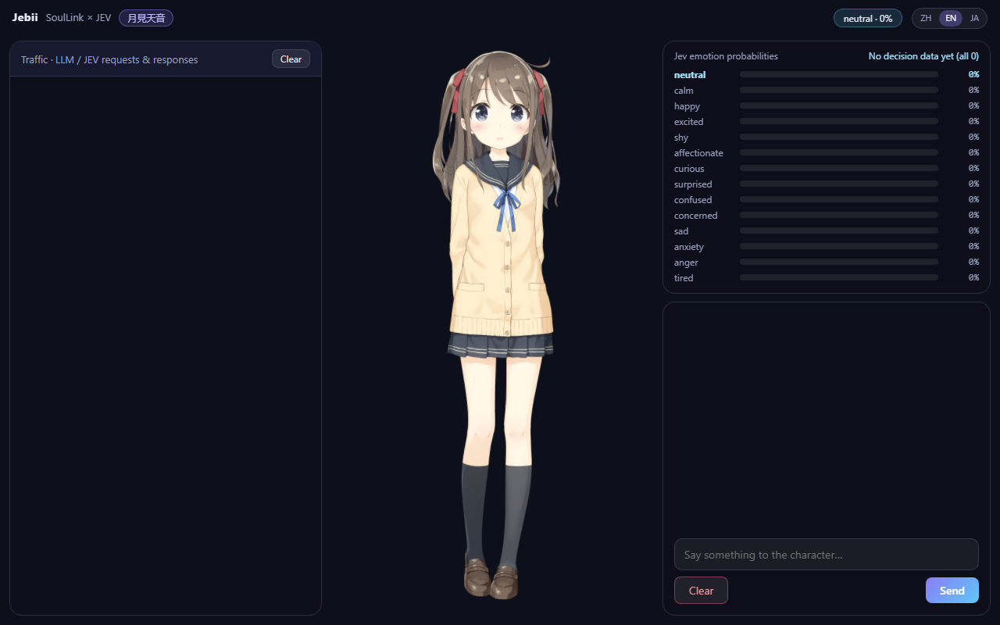
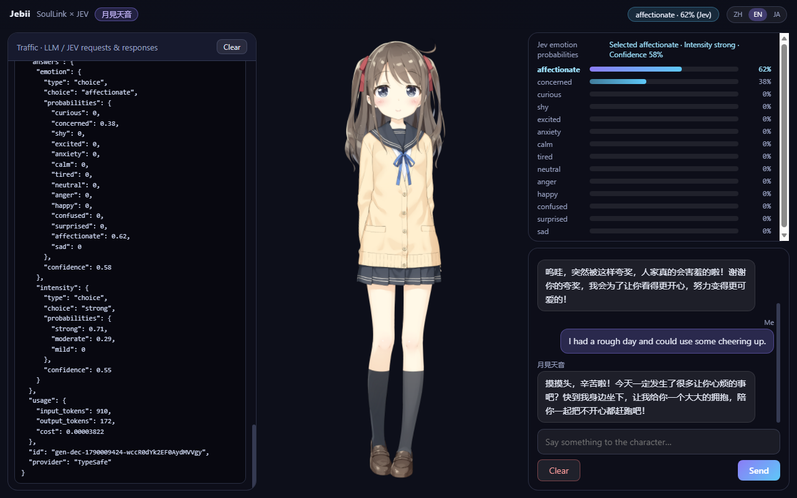

# Jebii

**Live2D 角色聊天 —— Jev 决定情绪，SoulLink 负责表演。**

Jebii 是一个运行在浏览器中的 Live2D 角色聊天应用。**Jev**（TypeSafe AI
的 System One 决策模型）负责情绪决策，**SoulLink** 表演引擎把每种情绪转化
为逐帧的 Live2D 表情与动作参数，常规的 OpenAI 兼容 LLM 负责生成聊天文本。
界面提供简体中文、英文与日文三种语言。默认角色人设为**月見天音（Tsukimi
Amane）**。

## 特性

- **无需提示词的情绪决策** —— 每轮对话后，Jev 回答一个类型化的 `Choice`
  问题，返回带校准概率与置信度的情绪。聊天提示词不会被情绪标签污染。
- **逐帧 Live2D 表演** —— SoulLink 引擎（`@soullink-emotion/*`）将
  VAD/FACS 情绪合成、Idle 动作与参数混合调和为每帧的 Live2D 参数值。
- **任意 OpenAI 兼容聊天 API** —— 自带端点（含 `/v1` 的 base URL、模型
  名、API Key），回复经 SSE 流式返回。
- **多语言界面** —— 简体中文、英文、日文；首次访问按浏览器语言自动检测，
  可随时在界面上手动切换。
- **多供应商云端语音（角色音色预存于仓库）** —— 音色预设存于
  `src/voices.js`，任何供应商都演绎同一批角色；TTS 与 ASR 供应商在设置中独立
  选择（内置 MiMo 与 MiniMax 适配，浏览器原生兜底）。朗读口型由真实播放音频
  电平驱动；麦克风按钮录音后经云端 ASR 转写。未配置语音通道时自动回退浏览器原生语音 API。
- **应用内设置** —— 通道覆盖（LLM/Jev 地址、令牌、模型名）、自动朗读与模型
  思维链开关、聊天导出/导入与通信日志导出；最新回复可一键重新回答。
- **PWA** —— 可安装到主屏幕，离线应用外壳；API 流量永不缓存。
- **移动端友好** —— 专属窄屏移动端布局。
- **密钥不进应用** —— 可选的内置通道经反向代理转发 LLM/Jev 流量；真实
  API Key 只存在于代理侧。
- **完整可观测** —— 通信日志记录每次 LLM 与 Jev 调用的完整请求体与响应体
  （不含鉴权头），支持按频道筛选与一键复制 JSON；情绪面板展示全情绪概率条、
  当前选择及其置信度，情绪轨迹条可视化最近 20 次决策。

### 预览

| 启动 | 对话 + Jev 面板 |
|:---:|:---:|
|  |  |

两张截图均经真实通道在线捕获。更多截图 —— 其他界面语言、更多轮对话与展开的
各面板 —— 见 [`docs/screenshots/`](screenshots/)。

## 架构

```
用户消息
   |
   |---> 聊天 LLM（任意 OpenAI 兼容 API）---> 流式文本（SSE）
   |
   |---> Jev（TypeSafe System One 模型）
   |       Choice：哪种情绪、什么强度？
   |       （校准概率 + 置信度）
   |
   +---> SoulLink 表演引擎
           VAD/FACS + Idle 动作 + 参数混合
           ---> 逐帧 Live2D 参数
                    |
                    v
           Live2D 渲染（PixiJS + Cubism Core）
```

| 关注点 | 由谁处理 | 位置 |
|---|---|---|
| 聊天文本 | 任意 OpenAI 兼容 LLM，SSE 流式 | `src/main.js` |
| 情绪决策 | Jev —— `POST /v1/systemone`（`jev-latest`），对情绪与强度的类型化 `Choice` 问题 | `src/main.js` |
| 表演 | `@soullink-emotion/*` 引擎（VAD/FACS、Idle、参数混合）驱动逐帧参数循环 | `src/live2d.ts` |
| 界面文案 | `t()` 字典（zh/en/ja），自动检测 + 运行时切换 | `src/i18n.js` |
| 人设 | 默认角色**月見天音（Tsukimi Amane）** | `src/main.js` 中的系统提示词 |

### 术语

- **Jev** —— TypeSafe AI 的 System One 决策模型。它不生成文本；它回答类型化
  问题（`Noul` / `Choice` / `Score`），返回结构化、概率校准的结果，代码可以
  直接分支使用。
- **SoulLink** —— `@soullink-emotion/*` 系列包：框架无关的 Live2D 表情与
  动作引擎，具备连续 VAD 情绪、FACS/AU 合成、分层动画与自动模型适配。

## 安装

前置条件：带 npm 的 Node.js，以及本仓库的一份副本。

```bash
npm install
```

> **npm ≥ 12 注意：** `esbuild` 的安装脚本需要显式批准：
> `npm install-scripts approve esbuild`。

然后为内置模型生成 SoulLink 表演档案。这是由模型 `cdi3` 参数元数据推导的
离线确定性启发式 —— 不涉及任何 LLM：

```bash
npm run gen:profile   # 生成 soullink.profile.json（默认模型：hiyori）
```

## 使用

1. 在浏览器中打开应用。加载门会自动做连通性检查 —— 配好内置通道即可开箱
   即用；否则把 `src/config.example.js` 复制为 `src/config.local.js` 并填写：
   - **聊天 LLM**（必填）：任意 OpenAI 兼容 API 的 base URL（含 `/v1`）、
     模型名、API Key。
   - **Jev 情绪决策**（可选）：官方 `https://api.typesafe.ai` 或中转
     `https://jev-ai.pro/api` —— Key 必须与端点匹配。留空时回退到
     SoulLink 规则情绪。
2. 开始聊天。回复旁边的情绪徽章即 Jev 概率详情的第一条（概率最高项）。
3. 随时通过顶栏的语言切换器切换界面语言（首次访问按浏览器语言自动检测）。

### Jev 何时触发？—— 无需提示词

每条消息只在回复完成后自动触发恰好一次 Jev 决策；发送瞬间由 SoulLink 规则
分类器给出即时反应，不调用 Jev。发给 Jev 的状态是强调了你最新消息的近期
对话。典型反应：夸赞 → happy/shy，倾诉 → sad/concerned，挑衅 → anger，
好消息 → excited。

### 查看内部过程

- **通信日志**（宽屏左侧面板，移动端为「日志」Tab）：每次 LLM 与 Jev 调用
  的完整请求体与响应体，不含鉴权头。
- **Jev 情绪面板**：全情绪概率条、当前选中的情绪及其置信度。

## 配置

把 `src/config.example.js` 复制为 `src/config.local.js`（已 gitignore）并
指向你的端点。内置通道模式把 LLM/Jev 流量连同低价值访问令牌一并发往反向
代理 —— 真实 API Key 只存在于代理侧，绝不进入应用。直接端点条目
（base URL + Key）同样可用。

应用内设置对话框（顶栏齿轮）把同样的通道覆盖存进浏览器 localStorage ——
自托管预构建产物时无需重新构建。其中还有音色与行为开关，以及聊天记录
导出/导入入口。

## 构建

| 命令 | 用途 |
|---|---|
| `npm run dev` | 启动 vite 开发服务器 |
| `npm run typecheck` | 类型检查 TypeScript 源码并语法检查 `src/main.js` |
| `npm run gen:profile` | 从模型 `cdi3` 重新生成 `soullink.profile.json` |
| `npm run build` | 构建 Web 应用（vite + 资源打包 + 预压缩） |
| `node scripts/web-smoke.mjs [url]` | 无头冒烟测试（默认连 `npx vite preview --port 4173`） |

`dist-web/` 中的构建产物是自包含静态站点，预期在 `/app/` 基础路径下服务
（见 `vite.config.mts`）；部署到其他位置时调整 `base` 选项即可。

## 项目结构

```
src/            Web 应用：index.html、main.js（聊天 + Jev + 界面逻辑）、
                i18n.js（zh/en/ja 文案）、live2d.ts（Live2D 驱动）、
                emotions.ts（三语情绪词表，与引擎词表编译期对齐）、
                types.ts、model-performance.ts（Hiyori 动作/FACS 预设）、
                样式表、config.example.js 模板
resources/      Cubism Core、Hiyori 模型、soullink.profile.json
scripts/        档案生成、Web 资源打包、构建期压缩
docs/           研究笔记、截图、翻译版 README
```

## 模型与 Live2D 许可

- **代码** —— MIT（见 [LICENSE](../LICENSE)）。
- `resources/core/live2dcubismcore.min.js` —— **Cubism Core**，Live2D Inc.
  专有许可。个人与年销售额 1000 万日元以下的小规模企业发布免费
  （Expandable Applications 除外）。见
  [Live2D SDK 许可页](https://www.live2d.com/en/sdk/license/)。
- `resources/models/hiyori/` —— Live2D 官方示例模型 **Hiyori**，遵循免费
  素材许可：按原样分发，不得改动角色设计，不得附带官方音频。见
  [resources/MODEL_LICENSE.md](../resources/MODEL_LICENSE.md)。
- **刻意不支持任意模型导入。** 允许用户加载自有 Live2D 模型的应用属于
  [Expandable Applications](https://www.live2d.com/en/sdk/license/expandable/)，
  无论发布者规模都需要 Live2D 审查与特殊发布许可。Jebii 刻意只随附内置
  单模型。

## 已知限制

- 云端语音走内置中继通道（密钥只留代理侧）；未配置时回退浏览器原生语音
  API，其音色与语言覆盖取决于平台。
- 仅内置 Hiyori 一个模型（见
  [模型与 Live2D 许可](#模型与-live2d-许可)）。

## 致谢

- [TypeSafe AI](https://typesafe.ai/) —— Jev System One 决策模型。
- [SoulLink_Live2D](https://github.com/nanlingyin/SoulLink_Live2D) 与
  [soullink-emotion-sdk](https://github.com/nanlingyin/soullink-emotion-sdk)
  —— SoulLink 表演引擎及其 npm 包。
- [Live2D Inc.](https://www.live2d.com/) —— Cubism Core 与 Hiyori 示例模型。
- [PixiJS](https://pixijs.com/)、pixi-live2d-display、Vite。
- 本项目的历史技术调研保留在 [docs/research.md](research.md)。

## 许可

- 代码：MIT —— 见 [LICENSE](../LICENSE)。
- `resources/core/live2dcubismcore.min.js`：Live2D Inc. 专有许可（个人与
  年销售额 1000 万日元以下的小规模企业发布免费）。
- `resources/models/hiyori/`：Live2D 官方示例数据，免费素材许可（按原样
  分发、不改设计、不带官方音频）。
- 细节见 [resources/MODEL_LICENSE.md](../resources/MODEL_LICENSE.md) 与
  [docs/research.md](research.md)。

---

[English](../README.md) | **简体中文** | [日本語](README.ja.md)
